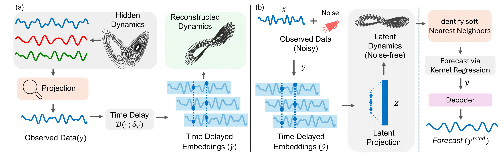
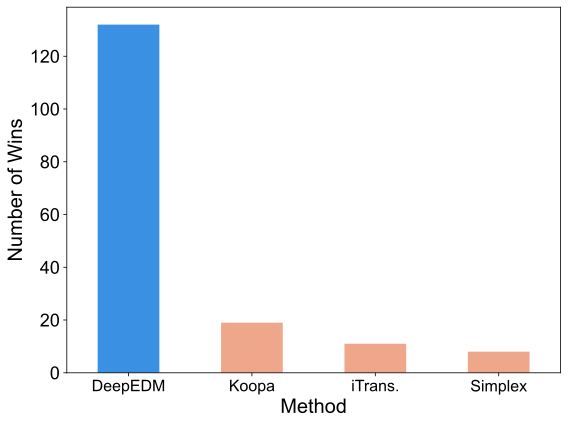
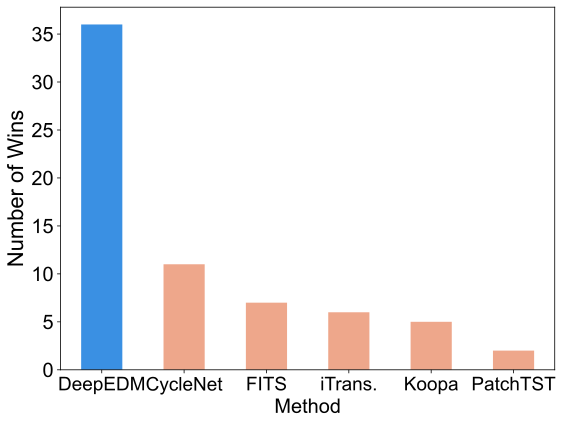
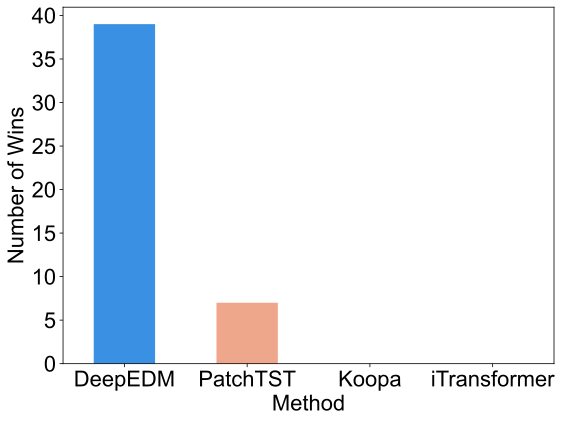

# LETS Forecast: Learning Embedology for Timeseries Forecasting
[](https://abrarmajeedi.github.io/deep_edm/)
[](https://arxiv.org/abs/2506.06454)

<span style="color:#e63946"><strong>Published at International Conference on Machine Learning (ICML) 2025!</strong></span>


## Abstract
Real-world time series are often governed by complex nonlinear dynamics. Understanding these underlying dynamics is crucial for precise future prediction. While deep learning has achieved major success in time series forecasting, many existing approaches do not explicitly model the dynamics. To bridge this gap, we introduce DeepEDM, a framework that integrates nonlinear dynamical systems modeling with deep neural networks. Inspired by empirical dynamic modeling (EDM) and rooted in Takens' theorem, DeepEDM presents a novel deep model that learns a latent space from time-delayed embeddings, and employs kernel regression to approximate the underlying dynamics, while leveraging efficient implementation of softmax attention and allowing for accurate prediction of future time steps. To evaluate our method, we conduct comprehensive experiments on synthetic data of nonlinear dynamical systems as well as real-world time series across domains. Our results show that DeepEDM is robust to input noise, and outperforms state-of-the-art methods in forecasting accuracy.




## 🔬 Experiments and Results

We evaluate **DeepEDM** on both synthetic and real-world time series to assess robustness, forecasting accuracy, and generalization.

### 📈 Synthetic Data Experiments


- Conducted on nonlinear dynamical systems with varying input noise.
- **DeepEDM** is robust to noise and consistently outperforms state-of-the-art baselines.

### 📊 Standard Forecasting Benchmarks


- Evaluated on diverse datasets (ETT, Weather, Traffic, etc.).
- Achieves superior forecasting accuracy across multiple horizons.

### 🔁 Generalization to Unseen Time Series


- Trained on a subset of variates and tested on unseen ones.
- **DeepEDM** generalizes well, outperforming baselines even on unseen series.


## Setup and Data

1. Set up the environment
```
conda create -n deepedm_env python=3.8

conda activate deepedm_env

pip install -r requirements.txt
```

2. You can obtain the well pre-processed datasets from [[Google Drive]](https://drive.google.com/drive/folders/13Cg1KYOlzM5C7K8gK8NfC-F3EYxkM3D2?usp=sharing) or [[Baidu Drive]](https://pan.baidu.com/s/1r3KhGd0Q9PJIUZdfEYoymg?pwd=i9iy) (made available by the awesome [Time-Series-Library](https://github.com/thuml/Time-Series-Library)) or you can download the data from their [GitHub page](https://github.com/thuml/Time-Series-Library).
3. Place the downloaded data in the folder`./dataset`
  

## Usage
We provide the scripts to run all benchmarks under the folder `./scripts/`. For convenience, we have added helper scripts to run experiments quickly


### Main Results (i.e., Table 1 in the paper)
To run the full set of main forecasting experiments:
```
bash ./tools/run_all.sh
```
Alternatively, to run a specific experiment for a single dataset and forecast length, run:

```
bash ./tools/quick_test_tsf.sh <DATASET> <SEED> <PRED_LEN_INDEX>
# 
# Arguments:
#   DATASET         – Name of the dataset (e.g., ETTh1, ETTh2, ETTm1, etc.)
#   SEED            – Random seed for reproducibility (e.g., 2021)
#   PRED_LEN_INDEX  – Setting Index indicating prediction length:
#                       0 → 48 steps
#                       1 → 96 steps
#                       2 → 144 steps
#                       3 → 192 steps

```
For example, to run an experiment on the ETTh1 dataset with a prediction length of 48 and a seed of 2021, we can run:

```
bash ./tools/quick_test_tsf.sh ETTh1 2021 0
```

To customize experiment parameters, modify the command-line arguments in the corresponding scripts located in: `./scripts/long_term_forecast` directory.


### Short-term Forecasting (M4 i.e., Table 5)
```
bash ./tools/quick_test_m4.sh
```

To customize experiment parameters, modify the command-line arguments in the corresponding scripts located in: `./scripts/short_term_forecast` directory.


### Lookback Searching (i.e., Table 6)
To run the full set of lookback search experiments:
```
bash ./tools/run_all_lookback_search.sh
```

Alternatively, to run a specific experiment for a single dataset and forecast length, run

```
bash ./tools/quick_test_lookback_search.sh <DATASET> <SEED> <PRED_LEN_INDEX>
#
# Arguments:
#   DATASET         – Name of the dataset (e.g., ETTh1, ETTm1, Weather, etc.)
#   SEED            – Random seed for reproducibility (e.g., 2021)
#   PRED_LEN_INDEX  – Index specifying the prediction length (which is longer for this setting):
#                       0 → 96 steps
#                       1 → 192 steps
#                       2 → 336 steps
#                       3 → 720 steps
```
For example, to run an experiment on the ETTh1 dataset with a prediction length of 96 and a seed of 2021, we can run:

```
bash ./tools/quick_test_lookback_search.sh ETTh1 2021 0
```

To customize experiment parameters, modify the command-line arguments in the corresponding scripts located in: `./scripts/lkbcksearch_long_term_forecast` directory.

*Note: Experiments on datasets with large number of variates (e.g., ECL, Solar, Traffic), especially for longer forecast lengths (>192), demand significantly more GPU memory.*

## Citation
If you find our work useful, please cite us as:
```
@inproceedings{majeedi2025lets,
	title={{LETS} Forecast: Learning Embedology for Time Series Forecasting},
	author={Abrar Majeedi and Viswanatha Reddy Gajjala and Satya Sai Srinath Namburi GNVV and Nada Magdi Elkordi and Yin Li},
	booktitle={Forty-second International Conference on Machine Learning},
	year={2025},
	url={https://openreview.net/forum?id=LLk1qYQatJ}
}
```
## Acknowledgement

This repository relies heavily on the amazing [Time-Series-Library](https://github.com/thuml/Time-Series-Library) repository. We are thankful for their work. Please check them out!

## Contact
If you have any questions about our work or code, feel free to email:
```
 Abrar Majeedi (majeedi@wisc.edu)
```